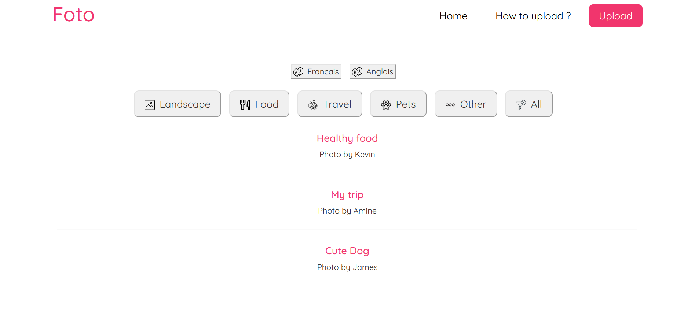
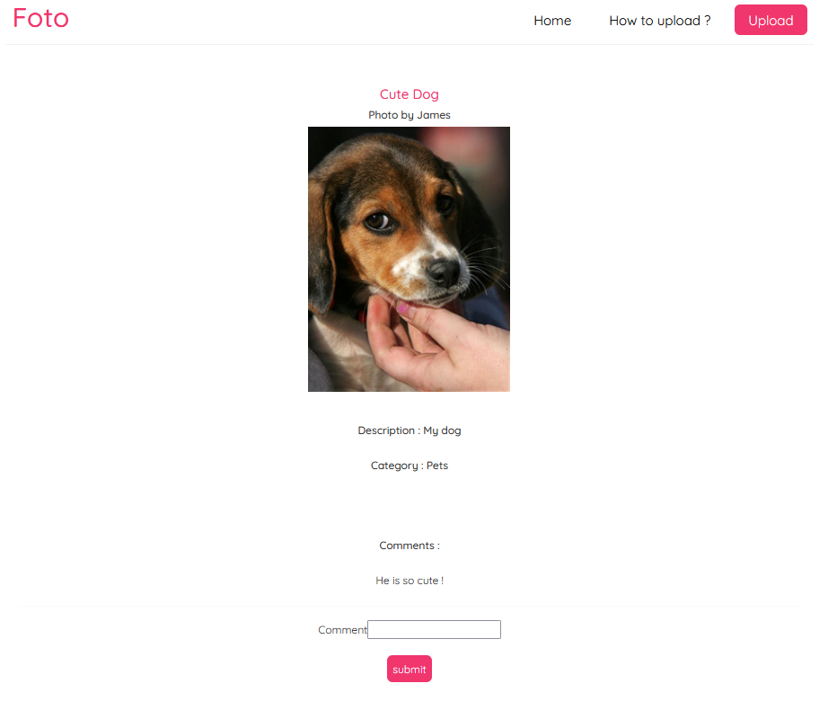
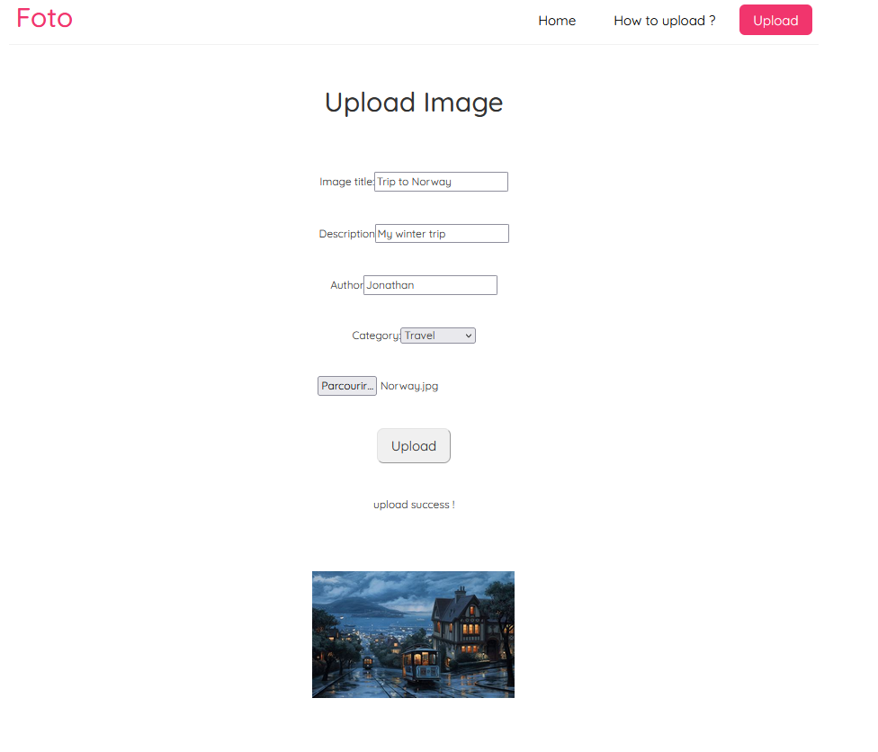

## Foto

A react website for people passionate about photography. They can share their posts and comment on them.

## Screenshots
### Home screen

### When you select a post

### Upload page

## Running locally
first run 

    npm start

Open http://localhost:3000 to view it in the browser.

On another console run (database)

    npx json-server --watch data/db.json --port 8000

